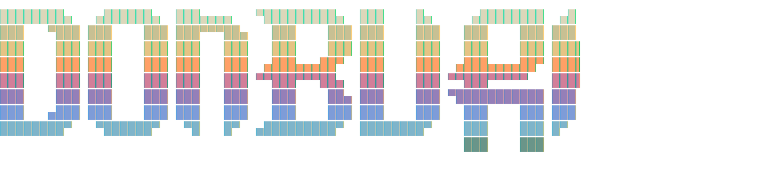

<p align="center">
  <br>
  
</p>
<p align="center">A unified macOS dotfiles configuration</p>

---

## Introduction

Donburi is a unified dotfiles repository for macOS that brings together window management, terminal, editor, and shell configurations into a cohesive development environment. Rather than treating each tool as an island, donburi creates a seamless workflow where navigation feels natural across all applications.

The philosophy centers on three principles: **consistent hjkl-based navigation** across all tools, a **unified Kanagawa color scheme** for visual harmony, and an **Aerospace-centric workflow** that makes window management effortless. Whether you're navigating Neovim splits or moving windows across workspaces, the muscle memory transfers.

Installation is **non-destructive**—existing configurations are automatically backed up before any changes are made. You can install everything at once or pick individual components to adopt incrementally.

<p align="center">
  
  <br>
  <sub>Screenshot taken on a 34" ultrawide monitor. This is my personal, opinionated configuration — your mileage may vary.</sub>
</p>

## Features

- **Unified hjkl-based navigation** across window manager, editor, and terminal
- **Non-destructive installation** with automatic backups of existing configs
- **Modular installation** — install all components or pick what you need
- **Consistent Kanagawa color scheme** across all applications
- **Workspace-centric workflow** via Aerospace tiling window manager
- **Quick config aliases** for editing any configuration file

## Requirements

- **macOS 15+** (Sequoia)
- **Git** — for cloning the repository
- **Homebrew** — package manager for macOS (optional with `--no-brew` flag)

All other dependencies are installed automatically during setup (see below).

**Note for corporate users**: See [ENTERPRISE_SETUP.md](ENTERPRISE_SETUP.md) for installation in restricted environments.

## Quick Start

**One-liner installation:**

```bash
curl -fsSL https://raw.githubusercontent.com/jonatas/donburi/main/install.sh | bash
```

This installs donburi to `~/.donburi` and adds the `donburi` command to your PATH.

**Or clone manually:**

```bash
git clone https://github.com/jonatas/donburi.git ~/.donburi
~/.donburi/donburi setup
```

After installation:

```bash
donburi brew-check      # Check Homebrew status
donburi brew apps       # Install applications (nvim, ghostty, aerospace, etc.)
donburi setup           # Install all configurations
```

For environments without Homebrew:

```bash
donburi setup --no-brew # Setup configs without brew dependencies
```

## Components

| Component      | Description                               | Config Location                                              |
| -------------- | ----------------------------------------- | ------------------------------------------------------------ |
| **Aerospace**  | Tiling window manager                     | `~/.config/aerospace`                                        |
| **Neovim**     | Text editor with LSP, completions, AI     | `~/.config/nvim`                                             |
| **Ghostty**    | Modern GPU-accelerated terminal           | `~/Library/Application Support/com.mitchellh.ghostty/config` |
| **Sketchybar** | Custom menu bar with workspace indicators | `~/.config/sketchybar`                                       |
| **tmux**       | Terminal multiplexer (minimal config)     | `~/.tmux.conf`                                               |
| **zsh**        | Shell configuration with Oh My Zsh        | `~/.zshrc`                                                   |

### What Setup Installs Automatically

Each `donburi setup` component installs its own dependencies via Homebrew and git:

| Component      | Auto-installed Dependencies                                                                                        |
| -------------- | ------------------------------------------------------------------------------------------------------------------ |
| **Neovim**     | ripgrep, gcc, make, [lazy.nvim](https://github.com/folke/lazy.nvim) plugin manager                                 |
| **Ghostty**    | JetBrains Mono Nerd Font                                                                                           |
| **Aerospace**  | jq, bash, [JankyBorders](https://github.com/FelixKratz/JankyBorders)                                               |
| **Sketchybar** | JetBrains Mono Nerd Font                                                                                           |
| **tmux**       | [TPM](https://github.com/tmux-plugins/tpm) + plugins                                                               |
| **zsh**        | [Oh My Zsh](https://ohmyz.sh/), [Powerlevel10k](https://github.com/romkatv/powerlevel10k), fzf, lsd, gnu-sed, gawk |

Neovim LSP servers and plugins auto-install on first launch via Mason and lazy.nvim.

### Custom Neovim Plugins

In addition to kickstart-modular.nvim's core plugins, donburi includes these custom plugins:

| Plugin | Purpose |
|--------|---------|
| **ChatGPT** | AI-powered code completion and generation |
| **dadbod** | Database UI and SQL query execution |
| **diffview** | Enhanced Git diff visualization |
| **fugitive** | Git integration and operations |
| **ghostty** | Ghostty terminal integration |
| **Kanagawa** | Unified color scheme (theme) |
| **lualine** | Customizable statusline |
| **markdown-preview** | Live Markdown preview |
| **python-debugger** | Python debugging support |
| **render-markdown** | Enhanced Markdown rendering |
| **smart-splits** | Smart window navigation and resizing |
| **toggleterm** | Integrated terminal multiplexer |

All plugins auto-install on first Neovim launch. View/manage with `:Lazy`.

### Sketchybar Indicators

Donburi's Sketchybar configuration includes these status indicators:

| Indicator | Purpose |
|-----------|---------|
| **Aerospace** | Current workspace number and available workspaces |
| **Front App** | Name of currently focused application |
| **Clock** | Current time and date |
| **CPU** | CPU usage percentage |
| **Memory** | RAM usage percentage |
| **Battery** | Battery level and charging status |
| **Spotify** | Current playing track (if active) |
| **Slack** | Slack status indicator |
| **VPN** | VPN connection status |

Indicators auto-update and use the Kanagawa color scheme. Customize in `~/.config/sketchybar/`.

## CLI Commands

The `donburi` command provides several utilities for managing your configuration:

### Core Commands

```bash
donburi setup [component]     # Install configurations
donburi status                # Check symlink status
donburi permissions           # Check macOS permissions for apps
donburi update                # Update donburi via git pull
donburi --version             # Show donburi version
donburi help                  # Show help message
```

### Admin Commands (Enterprise)

For corporate environments with system-wide Homebrew installations:

```bash
donburi admin-setup           # Setup as administrator
donburi admin-check           # Check admin setup status
```

See [ENTERPRISE_SETUP.md](ENTERPRISE_SETUP.md) for detailed corporate installation instructions.

### Homebrew Management

```bash
donburi brew-check            # Check Homebrew installation status
donburi brew [category]       # Install packages via Homebrew
donburi brew --list           # Show available packages without installing
```

Package categories:
- `apps` — UI applications (neovim, ghostty, aerospace, sketchybar)
- `cli` — Command-line tools (bat, fzf, ripgrep, gh, etc.)
- `utils` — Development utilities (node, python, slack, spotify)
- `docker` — Container tools (colima, docker, docker-compose)
- `all` — Install everything

### Setup Options

```bash
donburi setup              # Install all components
donburi setup nvim         # Install a single component
donburi setup --dry-run    # Preview changes without applying
donburi setup --no-brew    # Setup without Homebrew dependencies
```

### Enterprise Usage

For corporate environments where users don't have admin privileges:

```bash
# Admin runs:
sudo donburi brew all      # Install all brew packages system-wide

# User runs:
donburi setup --no-brew    # Setup configs without brew dependencies
```

See [ENTERPRISE_SETUP.md](ENTERPRISE_SETUP.md) for detailed corporate setup instructions.

## Keybinding Reference

Donburi uses consistent modifier patterns across tools. Aerospace uses `Alt` as the base modifier, Neovim uses `Ctrl`. Adding `Shift` triggers resize operations in both.

| Action           | Aerospace            | Neovim                |
| ---------------- | -------------------- | --------------------- |
| Focus / Navigate | `Alt + hjkl`         | `Ctrl + hjkl`         |
| Resize           | `Alt + Shift + hjkl` | `Ctrl + Shift + hjkl` |
| Move window      | `Alt + Ctrl + hjkl`  | —                     |
| Toggle layout    | `Alt + /`            | `Ctrl + /`            |
| Switch workspace | `Alt + 1-9`          | —                     |

### Keybinding Helper Commands

Display color-coded keybinding tables for various applications:

```bash
akeys               # Aerospace window manager keybindings
skeys               # Slack keybindings
ckeys               # Chrome/Chromium keybindings
gkeys               # Ghostty terminal keybindings
mkeys               # macOS system keybindings
```

Each command supports:

```bash
--no-pager          # Display without pager
--edit              # Edit the keybinding file
-h, --help          # Show command help
```

Example:

```bash
akeys main          # Show only Aerospace main mode keybindings
skeys --no-pager    # Show Slack keybindings without pager
gkeys --edit        # Open Ghostty keybindings for editing
```

## CLI Reference

```bash
donburi setup [component]     # Install configurations
donburi status                # Check symlink status
donburi brew [category]       # Install packages via Homebrew
donburi update                # Update donburi (git pull)
donburi help                  # Show help
```

### Setup Options

```bash
donburi setup              # Install all components
donburi setup nvim         # Install a single component
donburi setup --dry-run    # Preview changes without applying
```

Available components: `nvim`, `ghostty`, `aerospace`, `tmux`, `zsh`, `sketchybar`

### Brew Categories

```bash
donburi brew               # Install apps only (default)
donburi brew apps          # Install apps (nvim, ghostty, aerospace, tmux, sketchybar, jq, borders)
donburi brew cli           # Install CLI tools (bat, lsd, fzf, ripgrep, htop, wget, bash, gcc, make, gnu-sed, gawk, curl, gh)
donburi brew utils         # Install dev utilities & communication (node, python, slack, spotify)
donburi brew docker        # Install container tools (colima, docker, docker-compose, docker-buildx)
donburi brew all           # Install everything
donburi brew --list        # Show all packages without installing
donburi brew --dry-run     # Preview packages without installing
```

## Post-Installation

Verify the installation:

```bash
donburi status          # Check all symlinks (shows OK/WRONG/MISSING)
source ~/.zshrc         # Reload shell configuration
```

Test the setup:

1. Press `Alt + hjkl` to test Aerospace window navigation
2. Press `Alt + 1-9` to switch workspaces
3. Open `nvim` and run `:checkhealth` to verify plugins

Start Sketchybar if not running:

```bash
brew services start sketchybar
```

## Environment Variables

Customize installation and behavior using these environment variables:

### Installation Variables

Set these when running `install.sh` or during manual setup:

| Variable | Description | Default |
|----------|-------------|---------|
| `DONBURI_HOME` | Custom installation directory | `~/.donburi` |
| `DONBURI_BRANCH` | Git branch to install from | `main` |
| `DONBURI_BREW_PATH` | Custom Homebrew installation path (enterprise) | Auto-detected |

Example:

```bash
# Install to custom location
DONBURI_HOME=~/MyApps/donburi bash install.sh

# Install from development branch
DONBURI_BRANCH=dev bash install.sh

# Set custom Homebrew path (enterprise environments)
DONBURI_BREW_PATH=/opt/homebrew donburi setup --no-brew
```

## Config & Keybind Aliases

Quick shortcuts to edit configurations and view keybindings (added to your shell):

### Config Aliases

| Alias   | Opens             |
| ------- | ----------------- |
| `nconf` | Neovim config     |
| `aconf` | Aerospace config  |
| `gconf` | Ghostty config    |
| `tconf` | tmux config       |
| `zconf` | zsh config        |
| `sconf` | Sketchybar config |

### Keybind Aliases

| Alias   | Shows                  |
| ------- | ---------------------- |
| `akeys` | Aerospace keybindings  |
| `skeys` | Slack keybindings      |
| `ckeys` | Chrome keybindings     |
| `gkeys` | Ghostty keybindings    |
| `mkeys` | macOS keybindings      |

### Shell Aliases

Donburi includes `lsd` for a modern `ls` replacement:

| Alias | Command |
| ----- | ------- |
| `l`   | `lsd -l` (long format) |
| `la`  | `lsd -lA` (with hidden files) |
| `lla` | `lsd -llA` (long format, hidden files) |
| `tree` | `lsd --tree` (tree view) |

## Troubleshooting

**Ghostty tabs and Aerospace compatibility**

- **Note:** Ghostty's native tab feature doesn't integrate well with Aerospace's window management. It's recommended to use Aerospace splits instead of Ghostty tabs for a smoother workflow. Create new Ghostty windows with `Alt+T` and let Aerospace manage them as separate tiles.

**Aerospace not responding to keybindings**

- Grant accessibility permissions: System Settings → Privacy & Security → Accessibility → Enable AeroSpace

**Sketchybar not showing**

```bash
brew services start sketchybar
```

**Neovim plugins not loading**

- Run `:Lazy` inside Neovim to check plugin status
- Run `:checkhealth` for diagnostics

**Finding backed-up configs**

- Backups are stored in `~/.config/donburi-backup-<timestamp>/`

**donburi command not found**

- Restart your terminal or run: `export PATH="$HOME/.local/bin:$PATH"`

## Development

Donburi is actively maintained and welcomes contributions. Here are some useful resources:

### Project Files

| File | Purpose |
|------|---------|
| `VERSION` | Current version (0.1.0) |
| `CHANGELOG.md` | Version history and changes |
| `CLAUDE.md` | Development guidelines for AI assistants |
| `.pre-commit-config.yaml` | Pre-commit hooks (shellcheck linting) |
| `test/test_donburi.sh` | Test suite for CLI commands |

### Development Workflow

Before submitting pull requests, run the linting checks:

```bash
prek run --all-files    # Run pre-commit hooks (shellcheck, etc.)
prek install            # Install git pre-commit hook
```

For detailed contribution guidelines, see [CLAUDE.md](CLAUDE.md).

### Resources

- **Upstream Neovim config**: [kickstart-modular.nvim](https://github.com/dam9000/kickstart-modular.nvim)
- **Issues & PRs**: [GitHub repository](https://github.com/jonatas/donburi)

## License

MIT

## Acknowledgments

This project was built with significant assistance from [Claude Code](https://claude.ai/code), Anthropic's AI coding assistant.

- [kickstart-modular.nvim](https://github.com/dam9000/kickstart-modular.nvim) — Neovim configuration foundation
- [Kanagawa](https://github.com/rebelot/kanagawa.nvim) — color scheme
- [Aerospace](https://github.com/nikitabobko/AeroSpace) — tiling window manager
- [Ghostty](https://ghostty.org/) — terminal emulator
- [Sketchybar](https://github.com/FelixKratz/SketchyBar) — custom menu bar
