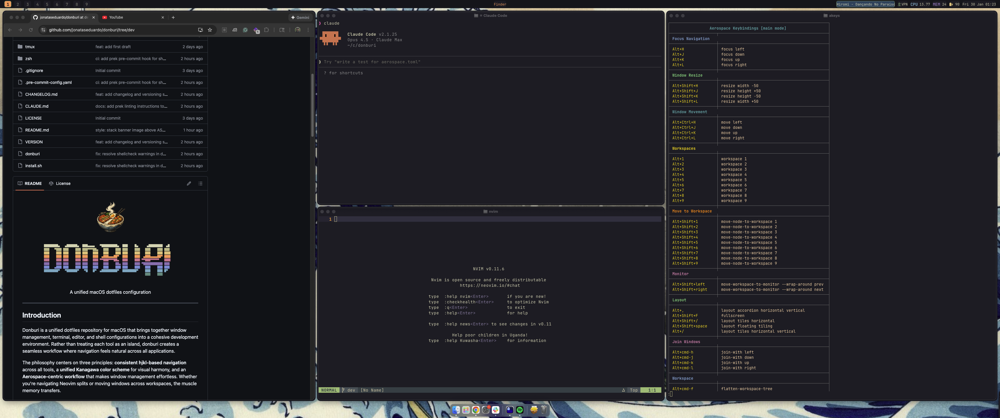

<p align="center">
  <br>
  
</p>
<p align="center">A unified macOS dotfiles configuration</p>

---

## Introduction

Donburi is a unified dotfiles repository for macOS that brings together window management, terminal, editor, and shell configurations into a cohesive development environment. Rather than treating each tool as an island, donburi creates a seamless workflow where navigation feels natural across all applications.

The philosophy centers on three principles: **consistent hjkl-based navigation** across all tools, a **unified Kanagawa color scheme** for visual harmony, and an **Aerospace-centric workflow** that makes window management effortless. Whether you're navigating Neovim splits or moving windows across workspaces, the muscle memory transfers.

Installation is **non-destructive**—existing configurations are automatically backed up before any changes are made. You can install everything at once or pick individual components to adopt incrementally.

<p align="center">
  
  <br>
  <sub>Screenshot taken on a 34" ultrawide monitor. This is my personal, opinionated configuration — your mileage may vary.</sub>
</p>

## Features

- **Unified hjkl-based navigation** across window manager, editor, and terminal
- **Non-destructive installation** with automatic backups of existing configs
- **Modular installation** — install all components or pick what you need
- **Consistent Kanagawa color scheme** across all applications
- **Workspace-centric workflow** via Aerospace tiling window manager
- **Quick config aliases** for editing any configuration file

## Requirements

- **macOS 15+** (Sequoia)
- **Homebrew** — package manager for macOS
- **Git** — for cloning the repository

All other dependencies are installed automatically during setup (see below).

## Quick Start

**One-liner installation:**

```bash
curl -fsSL https://raw.githubusercontent.com/jonatas/donburi/main/install.sh | bash
```

This installs donburi to `~/.donburi` and adds the `donburi` command to your PATH.

**Or clone manually:**

```bash
git clone https://github.com/jonatas/donburi.git ~/.donburi
~/.donburi/donburi setup
```

After installation:

```bash
donburi brew apps       # Install applications (nvim, ghostty, aerospace, etc.)
donburi setup           # Install all configurations
```

## Components

| Component      | Description                               | Config Location                                              |
| -------------- | ----------------------------------------- | ------------------------------------------------------------ |
| **Aerospace**  | Tiling window manager                     | `~/.config/aerospace`                                        |
| **Neovim**     | Text editor with LSP, completions, AI     | `~/.config/nvim`                                             |
| **Ghostty**    | Modern GPU-accelerated terminal           | `~/Library/Application Support/com.mitchellh.ghostty/config` |
| **Sketchybar** | Custom menu bar with workspace indicators | `~/.config/sketchybar`                                       |
| **tmux**       | Terminal multiplexer (minimal config)     | `~/.tmux.conf`                                               |
| **zsh**        | Shell configuration with Oh My Zsh        | `~/.zshrc`                                                   |

### What Setup Installs Automatically

Each `donburi setup` component installs its own dependencies via Homebrew and git:

| Component      | Auto-installed Dependencies                                                  |
| -------------- | ---------------------------------------------------------------------------- |
| **Neovim**     | ripgrep, gcc, make, [lazy.nvim](https://github.com/folke/lazy.nvim) plugin manager |
| **Ghostty**    | JetBrains Mono Nerd Font                                                     |
| **Aerospace**  | jq, bash, [JankyBorders](https://github.com/FelixKratz/JankyBorders)        |
| **Sketchybar** | JetBrains Mono Nerd Font                                                     |
| **tmux**       | [TPM](https://github.com/tmux-plugins/tpm) + plugins                        |
| **zsh**        | [Oh My Zsh](https://ohmyz.sh/), [Powerlevel10k](https://github.com/romkatv/powerlevel10k), fzf, lsd, gnu-sed, gawk |

Neovim LSP servers and plugins auto-install on first launch via Mason and lazy.nvim.

## Keybinding Reference

Donburi uses consistent modifier patterns across tools. Aerospace uses `Alt` as the base modifier, Neovim uses `Ctrl`. Adding `Shift` triggers resize operations in both.

| Action           | Aerospace            | Neovim                |
| ---------------- | -------------------- | --------------------- |
| Focus / Navigate | `Alt + hjkl`         | `Ctrl + hjkl`         |
| Resize           | `Alt + Shift + hjkl` | `Ctrl + Shift + hjkl` |
| Move window      | `Alt + Ctrl + hjkl`  | —                     |
| Toggle layout    | `Alt + /`            | `Ctrl + /`            |
| Switch workspace | `Alt + 1-9`          | —                     |

Use the `akeys` command to display a comprehensive, color-coded table of all Aerospace keybindings:

```bash
akeys               # Show all keybindings with pager
akeys main          # Show only main mode keybindings
akeys --no-pager    # Show without pager
```

## CLI Reference

```bash
donburi setup [component]     # Install configurations
donburi status                # Check symlink status
donburi brew [category]       # Install packages via Homebrew
donburi update                # Update donburi (git pull)
donburi help                  # Show help
```

### Setup Options

```bash
donburi setup              # Install all components
donburi setup nvim         # Install a single component
donburi setup --dry-run    # Preview changes without applying
```

Available components: `nvim`, `ghostty`, `aerospace`, `tmux`, `zsh`, `sketchybar`

### Brew Categories

```bash
donburi brew               # Install apps only (default)
donburi brew apps          # Install apps (nvim, ghostty, aerospace, tmux, sketchybar, jq, borders)
donburi brew cli           # Install CLI tools (bat, lsd, fzf, ripgrep, htop, wget, bash, gcc, make, gnu-sed, gawk, curl)
donburi brew utils         # Install dev utilities & communication (node, python, slack, discord, spotify)
donburi brew docker        # Install container tools (colima, docker, docker-compose, docker-buildx)
donburi brew all           # Install everything
donburi brew --list        # Show all packages without installing
```

## Post-Installation

Verify the installation:

```bash
donburi status          # Check all symlinks (shows OK/WRONG/MISSING)
source ~/.zshrc         # Reload shell configuration
```

Test the setup:

1. Press `Alt + hjkl` to test Aerospace window navigation
2. Press `Alt + 1-9` to switch workspaces
3. Open `nvim` and run `:checkhealth` to verify plugins

Start Sketchybar if not running:

```bash
brew services start sketchybar
```

## Config Aliases

Quick shortcuts to edit any configuration (added to your shell):

| Alias   | Opens             |
| ------- | ----------------- |
| `nconf` | Neovim config     |
| `aconf` | Aerospace config  |
| `gconf` | Ghostty config    |
| `tconf` | tmux config       |
| `zconf` | zsh config        |
| `sconf` | Sketchybar config |

## Troubleshooting

**Ghostty tabs and Aerospace compatibility**

- **Note:** Ghostty's native tab feature doesn't integrate well with Aerospace's window management. It's recommended to use Aerospace splits instead of Ghostty tabs for a smoother workflow. Create new Ghostty windows with `Alt+T` and let Aerospace manage them as separate tiles.

**Aerospace not responding to keybindings**

- Grant accessibility permissions: System Settings → Privacy & Security → Accessibility → Enable AeroSpace

**Sketchybar not showing**

```bash
brew services start sketchybar
```

**Neovim plugins not loading**

- Run `:Lazy` inside Neovim to check plugin status
- Run `:checkhealth` for diagnostics

**Finding backed-up configs**

- Backups are stored in `~/.config/donburi-backup-<timestamp>/`

**donburi command not found**

- Restart your terminal or run: `export PATH="$HOME/.local/bin:$PATH"`

## License

MIT

## Acknowledgments

This project was built with significant assistance from [Claude Code](https://claude.ai/code), Anthropic's AI coding assistant.

- [kickstart-modular.nvim](https://github.com/dam9000/kickstart-modular.nvim) — Neovim configuration foundation
- [Kanagawa](https://github.com/rebelot/kanagawa.nvim) — color scheme
- [Aerospace](https://github.com/nikitabobko/AeroSpace) — tiling window manager
- [Ghostty](https://ghostty.org/) — terminal emulator
- [Sketchybar](https://github.com/FelixKratz/SketchyBar) — custom menu bar
